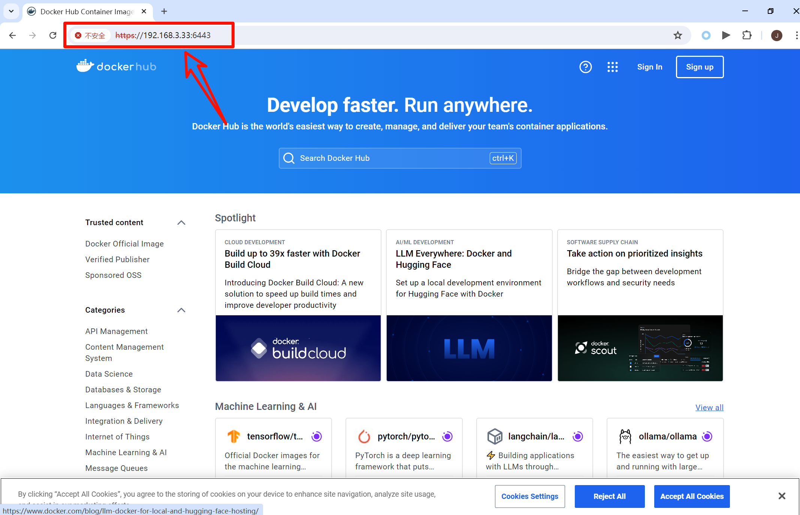
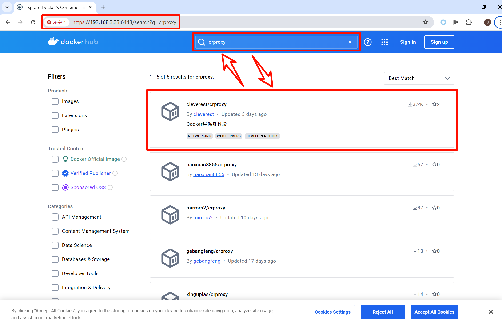
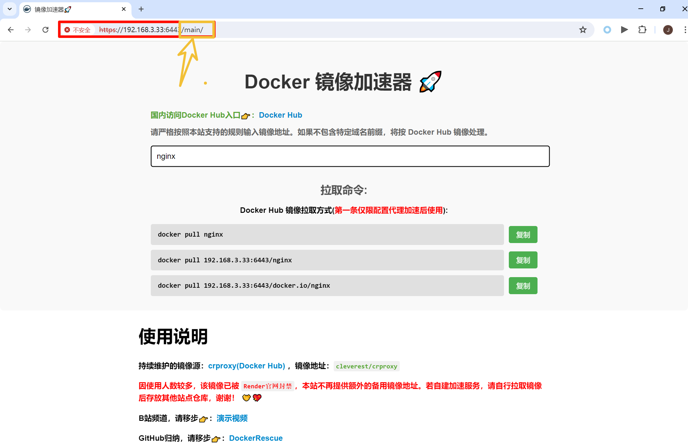

# 📝Docker部署加速器（crproxy）

该镜像服务，依赖开源项目 **[DaoCloud（crproxy）](https://github.com/DaoCloud/crproxy)**，持续维护的镜像源：**[crproxy服务镜像(Docker Hub)](https://docker.openeeds.com/r/cleverest/crproxy)** 。

支持 **`linux/386`** **`linux/amd64`** **`linux/arm64`** **`linux/arm/v6`** **`linux/arm/v7`**  架构的Docker部署，前提是服务器能够使用 **魔法(代理梯子)** 的情况下实施。

B站频道，请移步👉：[演示视频](https://www.bilibili.com/video/BV1QhgqeCE61/) 

部署方案1： **`Render`** 部署，请移步👉：[教程链接](https://mp.weixin.qq.com/s/dmlP_lyf6YElgnnpkOEfRw)

部署方案2： **`服务器`** 部署，请移步👉：[教程链接](https://github.com/iCloudBot/DockerRescue/tree/main/2.Deploy-Docker-Proxy)

## 1 平台优势特点

### 1.1 支持多镜像平台

> 支持除Docker Hub以外的镜像站点拉取

|  序号  | 源站                      | 平台                              |
| :--: | ----------------------- | ------------------------------- |
|  1   | docker.io               | Docker Hub                      |
|  2   | gcr.io                  | Google Container Registry       |
|  3   | ghcr.io                 | GitHub Container Registry       |
|  4   | k8s.gcr.io              | Kubernetes Container Registry   |
|  5   | registry.k8s.io         | 新 Kubernetes Container Registry |
|  6   | quay.io                 | Red Hat Container Registry      |
|  7   | mcr.microsoft.com       | Microsoft Container Registry    |
|  8   | docker.elastic.co       | Elastic Container Registry      |
|  9   | nvcr.io                 | NVIDIA Container Registry       |
|  10  | registry.jujucharms.com | Juju Charms                     |
|  11  | cr.l5d.io               | Linkerd  Container Registry     |

### 1.2 支持站内DockerHub访问

搭建好之后，访问当前部署的 **`IP+端口`** 或 **`域名`** 可直接打开 **`Docker Hub`** 官网。

然后呢，在当前站内，就能搜索查询 docker 镜像，无需再次开启代理(Proxy)访问，非常的方便。

使用文档入口：  **`IP+端口/main/`** 或 **`域名/main/`** ，例如： **`https://192.168.3.33:6443/main/`** 

**注意：** 必须要在 **`main`** 后要加 **`/`** 

默认情况，不开启此方案。若需开启，则运行容器时加上 **`-e dockerhub=true`** ，更多详情参加后面步骤。 

|  |
| ----------------------------- |
|  |
|  |

### 1.3 DockerHub多种方式拉取

若镜像来源于 **`Docker Hub`** 镜像仓库，支持 `3种` 拉取方式。

```bash
# 方式 1：加镜像站域名（docker.io）
docker pull 192.168.3.33:6443/docker.io/alpine:3.18

# 方式 2：不加镜像站域名（docker.io）
docker pull 192.168.3.33:6443/nginx
docker pull 192.168.3.33:6443/mysql:5.7

# 方式 3：配置/etc/docker/daemon.json后
docker pull redis
docker pull grafana/grafana:latest
```


## 1.部署Docker加容器

### 1.1 IP代理（不绑定域名）

使用 **`IP`** 作为加速器地址，不绑定任何域名。

若部署的宿主机IP地址为： **`192.168.3.33`** ，只需将容器内部 **`443`** 端口映射出来即可， **`80`** 端口可不作映射，为避免宿主机 **`443`** 端口被占用，示例中 出端口映射到 **`6443`** 上。执行完下面指令后，访问 **`https://192.168.3.33:6443`** ，成功加载页面，则部署完成。

```bash
docker run -d --name crproxy \
    --restart always \
    -p 6443:443 \
    cleverest/crproxy
```

如果需要开启 `Docker Hub` 站内访问，则加上环境变量 **`-e dockerhub=true`** ，请根据需求自行增加或删减相对应的变量。（ **推荐方式** ）

执行完下面指令后，页面访问地址：

- **`https://192.168.3.33:6443`** 
- **`https://192.168.3.33:6443/main/`** 

```bash
docker run -d --name crproxy \
    --restart always \
    -p 6443:443 \
    -e dockerhub=true \
    cleverest/crproxy
```

如果 **`服务器`** 使用了代理梯子，则需要在运行时加上代理的地址。以 **`Clash`** 为例：**`IP:192.168.3.88`** 、 **`端口：7890`** ，则

```bash
docker run -d --name crproxy \
    --restart always \
    -p 6443:443 \
    -e http_proxy=http://192.168.3.88:7890 \
    -e https_proxy=http://192.168.3.88:7890 \
    -e no_proxy=127.0.0.1,localhost \
    -e HTTP_PROXY=http://192.168.3.88:7890 \
    -e HTTPS_PROXY=http://192.168.3.88:7890 \
    -e NO_PROXY=127.0.0.1,localhost \
    cleverest/crproxy
```


### 1.2 配置加速器

​	在 **`/etc/docker/daemon.json`** 文件， **`registry-mirrors`** 、 **`insecure-registries`** 字段中，将宿主机IP添加至对应的位置，必须添加 **`insecure-registries`** 字段值，跳过不安全证书验证。然后，修改下面示例，复制粘贴到终端执行，如

```bash
cat > /etc/docker/daemon.json <<EOF
{
  "registry-mirrors": ["https://192.168.3.33:6443"],
  "insecure-registries": ["192.168.3.33:6443"],
  "exec-opts": ["native.cgroupdriver=systemd"]
}
EOF
```

```bash
# 重启Docker服务
systemctl daemon-reload && systemctl restart docker
```


## 2.拉取测试

📢 **注意事项：** 若配置了加速器地址，并且镜像源于 **`Docker Hub`** 时，**可以无需加上域名前缀**，其他镜像源站必须加上前缀，例如：

- 源于 **`Docker Hub`** 镜像地址： **`alpine:3.18`** 与 **`adguard/adguardhome`** ，则

```bash
docker pull alpine:3.18
docker pull adguard/adguardhome

# 当然也是可以加上前缀，如：
docker pull 192.168.3.33:6443/docker.io/alpine:3.18
docker pull 192.168.3.33:6443/docker.io/adguard/adguardhome
```

- 拉取非 **`Docker Hub`** 平台镜像时， **必须加域名前缀**，各个知名镜像站拉取测试，如下：

```bash
# Google
docker pull 192.168.3.33:6443/gcr.io/kaniko-project/executor:debug
# GitHub
docker pull 192.168.3.33:6443/ghcr.io/openfaas/queue-worker
# Kubernetes
docker pull 192.168.3.33:6443/k8s.gcr.io/etcd:3.5.7-0
# 新Kubernetes
docker pull 192.168.3.33:6443/registry.k8s.io/kube-apiserver:v1.30.0
# Red Hat
docker pull 192.168.3.33:6443/quay.io/calico/cni
# Microsoft
docker pull 192.168.3.33:6443/mcr.microsoft.com/powershell
# Elastic 
docker pull 192.168.3.33:6443/docker.elastic.co/elasticsearch/elasticsearch:8.1.0
# NVIDIA
docker pull 192.168.3.33:6443/nvcr.io/nvidia/cuda:12.1.0-runtime-ubuntu20.04
```


## 3.域名绑定

### 3.1 推荐反向代理方式

若域名为 **`www.example.com`** ，代理的宿主机IP地址： **`https://192.168.3.33:6443`** ，代理配置如下

```bash
server {
    listen 80;
    server_name www.example.com;

    # Redirect HTTP to HTTPS
    return 301 https://$host$request_uri;
}

server {
    listen 443 ssl;
    server_name www.example.com;

    ssl_certificate /你的证书路径/cert.pem;
    ssl_certificate_key /你的证书路径/privkey.pem;

    location / {
        proxy_pass https://192.168.3.33:6443;
        proxy_set_header Host $host;
        proxy_set_header X-Real-IP $remote_addr;
        proxy_set_header X-Forwarded-For $proxy_add_x_forwarded_for;
        proxy_set_header X-Forwarded-Proto $scheme;
    }
}
```

### 3.2 不使用反向代理方式

不使用反向代理方式，就有必要映射 **`443`**  端口，同时映射证书文件，并且加上域名环境变量： **`-e domain=你的域名(www.example.com)`** 。

例如，证书文件所在路径： **`/path/to/your_cert.crt`**  **`/path/to/your_privkey.key`** ，则映射证书的地址应为：
**`-v /path/to/your_cert.crt:/etc/nginx/certs/cert.pem`** 
**`-v /path/to/your_privkey.key:/etc/nginx/certs/privkey.pem`** 

⚠注意：容器内部的证书地址及名称已经固定，不能作任何的修改。

```bash
docker run -d --name crproxy \
	--restart always \
	-p 443:443 \
	-e domain=你的域名(www.example.com) \
	-v /你的证书路径/证书文件cert.pem:/etc/nginx/certs/cert.pem \
	-v /你的证书路径/证书文件privkey.pem:/etc/nginx/certs/privkey.pem \
	cleverest/crproxy
```


## 4.其他证书格式

### 4.1 PEM 格式的证书

对于 PEM 格式的证书，直接将证书文件挂载到容器内的固定路径：

```bash
docker run -d --name crproxy \
	--restart always \
	-p 443:443 \
	-e domain=www.example.com \
	-v /path/to/your_cert.pem:/etc/nginx/certs/cert.pem \
	-v /path/to/your_privkey.pem:/etc/nginx/certs/privkey.pem \
	cleverest/crproxy
```

### 4.2 PFX/P12 格式的证书

如果你的证书是 PFX/P12 格式，你需要先将其转换为 PEM 格式。以下是转换命令：

```bash
openssl pkcs12 -in /path/to/your_cert.pfx -nocerts -out /path/to/your_privkey.pem
openssl pkcs12 -in /path/to/your_cert.pfx -clcerts -nokeys -out /path/to/your_cert.pem
```

然后使用上述挂载 PEM 证书的方式运行容器。

### 4.3 CRT 和 KEY 格式的证书

对于 CRT 和 KEY 格式的证书，可以直接将其映射为 PEM 格式：

```bash
docker run -d --name crproxy \
	--restart always \
	-p 443:443 \
	-e domain=www.example.com \
	-v /path/to/your_cert.crt:/etc/nginx/certs/cert.pem \
	-v /path/to/your_privkey.key:/etc/nginx/certs/privkey.pem \
	cleverest/crproxy
```

### 4.4 JKS 格式的证书

如果你的证书是 JKS 格式，你需要先将其转换为 PEM 格式。以下是转换命令：

```bash
keytool -importkeystore -srckeystore /path/to/your_cert.jks -srcstoretype jks -deststoretype pkcs12 -destkeystore /path/to/your_cert.p12
openssl pkcs12 -in /path/to/your_cert.p12 -nocerts -out /path/to/your_privkey.pem
openssl pkcs12 -in /path/to/your_cert.p12 -clcerts -nokeys -out /path/to/your_cert.pem
```

然后使用上述挂载 PEM 证书的方式运行容器。
