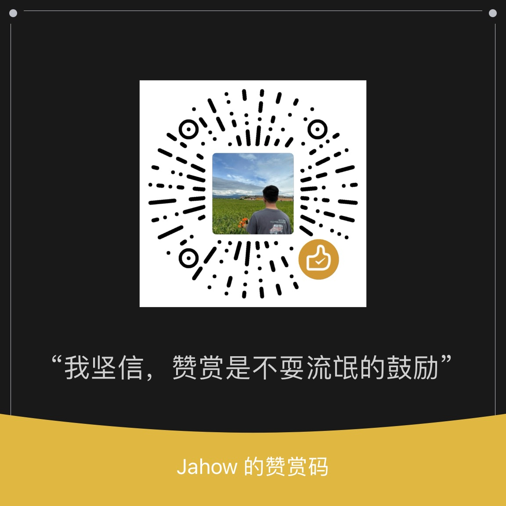

# DockerRescue

## 使用说明

2024年6月6日，国内实施了对Docker Hub的访问禁令。这一举措导致国内用户在尝试拉取或上传Docker镜像时遇到连接超时和TLS握手超时等问题。

因此诞生了诸多替代方案，该项目主要介绍了3种方案，仅供给大家参考。

方案1：[1.Ali-ACR-Docker](https://github.com/iCloudBot/DockerRescue/tree/main/1.Ali-ACR-Docker)，由小编自行研究。

方案2：[2.Deploy-Docker-Proxy](https://github.com/iCloudBot/DockerRescue/tree/main/2.Deploy-Docker-Proxy)，由小编自行研究，也是最推荐的一种，个人认为是目前为止最完美的方案。

方案3：[3.CF-Workers-Docker](https://github.com/cmliu/CF-Workers-docker.io)，由大佬 [cmliu](https://github.com/cmliu/CF-Workers-docker.io) 分享设计。

## 项目支持
### 用爱发电
小编B站频道：[严同学科技探险](https://space.bilibili.com/242066560) ，初出茅庐，请多多指教，多多包涵 🤝。

不定时分享各种实用教程分享，感谢兴趣的小伙伴可以点个关注，不胜感激。

如果您觉得教程对你有帮助，欢迎您通过以下二维码打赏作者一杯茶。🍵

制作不易，再次感谢对我的支持！❤️

|                    微信                    |                   支付宝                    |
| :--------------------------------------: | :--------------------------------------: |
|  |  |

**提示**

如有赞助行为，请务必添加备注，以便统一感谢！
