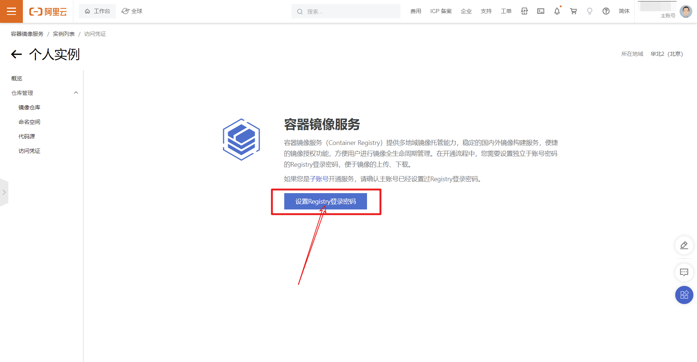
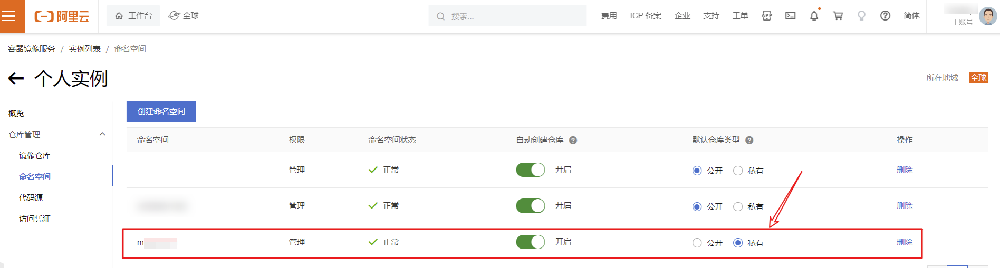
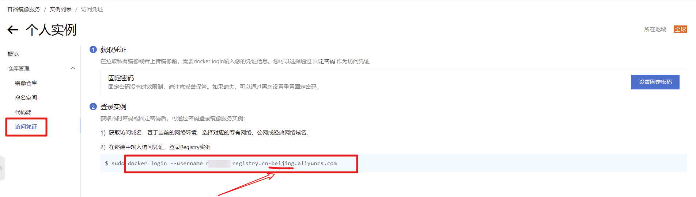
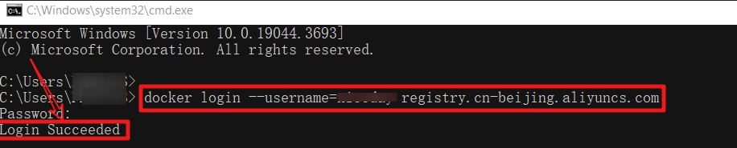

# 文件说明

- `imgsrc` 目录文件，存放文档图片。
- `images.txt` 文件，存放镜像列表。
- `email.txt` 文件，存放接收人邮箱地址。
- `platform.txt` 文件，存放镜像系统架构名称。


# 阿里云镜像服务（ACR）注册使用


## 1 创建镜像个人实例

> 首先登录阿里云，进入到ACR镜像服务界面，登录地址👉：[阿里云镜像服务](https://cr.console.aliyun.com)


## 2 设置镜像服务密码



## 3 创建镜像命名空间
> 进入到个人实例管理界面，创建一个镜像的命名空间，自定义名称可填写小写英文字母、数字，可使用的分隔符包括“_”、“-”，设置为私有仓库即可。


> 可以设置仓库为`公开` 或 `私有` 



> 设置镜像仓库的登录密码，**访问凭证** → **设置固定密码**。


## 4 获取镜像地址
> 这里需要注意一下，确认你的镜像需要上传到哪个地区，这里以 **`北京`** 为例。
> 点击 **`镜像仓库`** ，切换地区，然后点击 **`访问凭证`** ，会看到有一个登录地址，区域也是北京。




> 若你创建的命名空间为： **`dockerip`** 
>
> 镜像地区： **`北京(beijing)`**  
>
> 镜像的登录地址： **`registry.cn-beijing.aliyuncs.com`** 
>
> 示例镜像名称及标签： **`mysql:8.0`** 

> 最终的完整镜像地址为： **登录地址/命名空间/镜像名称及标签 =>** **`registry.cn-beijing.aliyuncs.com/dockerip/mysql:8.0`** 


## 5 登录仓库地址

> 本地登录验证，复制访问凭证地址到命令行终端，回车，然后输入密码，看到Login Succeed 字样就是登录成功了。

```bash
docker login --username=你的用户名 registry.cn-beijing.aliyuncs.com
```
